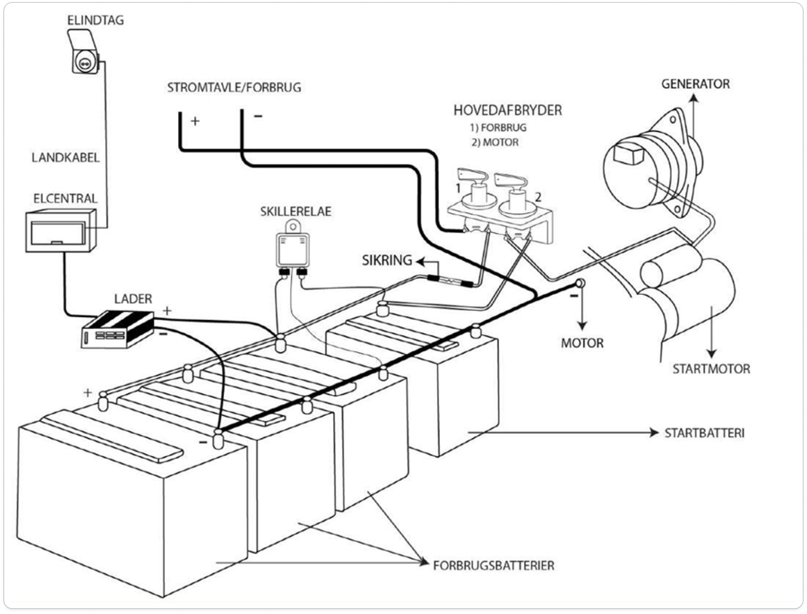

I vinterhalvåret skal elektronikken omkring betty laves om. Pr dags dato er der rod i ledningerne kort fortalt og en enormt stor mængde energi går tabt i at lave spændingen om en masse gange før den når ud til den komponent som skal bruge den. Vi vil i grove træk lave noget nyt. Udover det er der også en række mindre opgaver som skal løses. Listen er ikke komplet men det er de vigtigste ting som er skrevet ned og prioriteret.

Elholdet er PT (oktober 2024):

- Amalie Bjørk
- Andreas Funch Petersen
- Jakob Mortensen
- Jeppe Firring Givskud
- Knud Heebøll

Tusind tak for at melde jer til :D

Herunder kan ses et diagram over elsystemer. Det er taget fra en fantastisk ressource om el ombord på skibe: https://vimeo.com/871439384/2bdb0fe696?ts=0&share=copy

