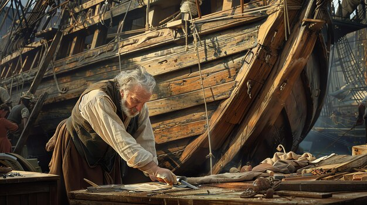

I løbet af vinteren arbejdes der på træskibet Betty. Der er en enorm hyggelig tid hvor der hver onsdag samles en masse unge på skibet og løser diverse opgaver. I år (2024) er der blevet oprettet 6 udvalg for at strukturere arbejdet.

- [Aptering]( "Aptering") - Mads Berg
- [Elektronik]( "Elektronik") - Jeppe Firring Givskud
- [Fondansøgninger]( "Fondansøgninger") - Ikke besat
- [Maskine]( "Maskine") - Morten Rise
- [Rig]( "Rig") - Frederik Dam Sørensen
- [Sikkerhed]( "Sikkerhed") - Amanda Ramskov
